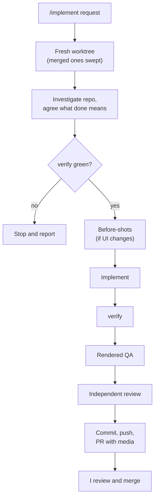

# coding-agent-config

This is the configuration I use to make coding agents more reliable across my projects.

## The case

Coding agents are very capable, but handing one a task and hoping for the best is still pretty hit or miss. One run is careful; the next skips the tests, never looks at the UI and hands me a PR I have to reverse-engineer.

I don't think the fix is writing the perfect prompt every time. **The fix is a workflow around the agent** that does the heavy lifting:

* the repository, not my prompt, is the source of truth;
* deterministic gates the agent can't talk its way past;
* actually looking at the rendered UI, including how it moves;
* an independent reviewer for changes where judgement matters; and
* a pull request I can review in a minute.

The agent gets to do the work. **Product decisions and merges stay with me.**

## What you get

* An isolated worktree per task, swept away automatically on a later run once its PR is merged.
* A green `npm run verify` before work starts and again before delivery.
* Rendered QA across desktop, tablet and mobile, including animations, reduced motion, keyboard use and console errors.
* PRs with before/after screenshots, GIFs for motion, the tests that protect the behaviour, and a call on how dangerous the merge is.
* One configuration shared by [OpenCode](https://opencode.ai/) and [Claude Code](https://code.claude.com/).

## The flow



Not every change needs every step. A one-line fix doesn't get an independent review; a substantial feature does. The workflow is deliberately proportional.

## What's in the box

| | Name | What it does |
| --- | --- | --- |
| Command | [`/implement`](commands/implement.md) | Takes a request from investigation to a reviewable PR |
| Command | [`/qa`](commands/qa.md) | Hands-on rendered QA of a route, flow, PR or session; reports, never edits |
| Command | [`/update-my-workflow`](commands/update-my-workflow.md) | Audits or changes this configuration coherently |
| Command | [`/ux.principles`](commands/ux.principles.md) | Writes or refines a product's `UX_PRINCIPLES.md` |
| Agent | [`code-reviewer`](agent/code-reviewer.md) | Independent review via OCR delegation, plus the merge-danger call |
| Agent | [`ui-designer`](agent/ui-designer.md) | Designs and implements UI grounded in the repo |
| Skill | [`rendered-qa`](skills/rendered-qa/SKILL.md) | How to exercise a running UI and capture evidence |
| Skill | [`commit-pr-writing`](skills/commit-pr-writing/SKILL.md) | Commit messages and PR descriptions that prove their claims |
| Skill | [`repo-context`](skills/repo-context/SKILL.md) | Evidence-based map of an unfamiliar repository |
| Skill | [`ui-designer`](skills/ui-designer/SKILL.md) | Practical UI judgement: hierarchy, layout, forms, accessibility |
| Skill | [`frontend-design`](skills/frontend-design/SKILL.md) | Aesthetic direction for new or reshaped UI |
| Skill | [`ux-principles`](skills/ux-principles/SKILL.md) | Product-level UX principles discovery |
| Skill | [`angular`](skills/angular/SKILL.md) | Angular architecture, forms, state and testing guidance |
| Skill | [`playwright-tests`](skills/playwright-tests/SKILL.md) | Resilient Playwright UI tests |
| Skill | [`skill-creator`](skills/skill-creator/SKILL.md) | Creating and evaluating skills |
| Skill | [`workflow-for-alex`](skills/workflow-for-alex/SKILL.md) | Governance for changing this workflow |
| Script | [`implementation-workspace`](scripts/implementation-workspace.mjs) | Worktree lifecycle: prepare, publish, PR media, cleanup |
| Script | [`verify-runner`](scripts/verify.mjs) | Runs a repo's checks with quiet passes and full failure output |
| Script | [`install.mjs`](scripts/install.mjs) | Links everything into both hosts |

[`AGENTS.md`](AGENTS.md) holds the cross-project engineering principles, including when agents may branch, commit and open PRs. `opencode.json` and `claude/agents.json` hold the host-specific bits; `claude/agents/` is generated from `agent/` by `npm run agents:generate`.

## Getting started

**Prerequisites:** Node.js, the [`gh`](https://cli.github.com/) CLI (signed in), the [`ocr`](https://github.com/alibaba/open-code-review) CLI for reviews, the [Playwright MCP](https://github.com/microsoft/playwright-mcp) server in your host for rendered QA, and `ffmpeg` if you want GIFs.

Put `~/.local/bin` on your `PATH`, then from a checkout of this repo on `main`:

```bash
node scripts/install.mjs
node scripts/install.mjs --check
```

The installer links the shared files into `~/.config/opencode/` and `~/.claude/`, puts `verify-runner` and `implementation-workspace` in `~/.local/bin`, and adds a `post-merge` hook so a later `git pull` on `main` reinstalls automatically. It never overwrites existing configuration; on a conflict it stops and lists the paths. For Claude Code, add Playwright in user scope:

```bash
claude mcp add --scope user playwright -- npx -y @playwright/mcp@latest --headless --isolated
```

**An app repo needs one thing:** an `npm run verify` script that defines "mechanically healthy" for that project (lint, types, tests, whatever fits). Nothing host-specific.

**A first command to try**, from the app repo's default branch:

```text
/implement show the last sync time on the settings page
```

For occasional manual use:

```bash
implementation-workspace list                     # retained workspaces
implementation-workspace info --session <id>      # paths, branch and PR for one
implementation-workspace cleanup                  # what would be removed (dry run)
implementation-workspace cleanup --dry-run false  # remove merged, consumed ones
```

You rarely need the last two: every `/implement` sweeps merged workspaces on the way in.

## Principles

* **Repository first.** The app repo owns its architecture and conventions; this config sits above it.
* **Deterministic before prose.** If a tool can check it, don't rely on an agent remembering an instruction.
* **Proportional process.** Ceremony scales with the change.
* **The human owns merges.** Agents can prove, review and propose. They don't decide what ships.

The full reasoning lives in [`workflow-for-alex`](skills/workflow-for-alex/SKILL.md).

## Using it yourself

Go for it. This repo is public because I wanted to share the workflow I've been building while using coding agents day to day.

It's opinionated around how **I** like to work, so I wouldn't copy the whole thing and expect it to fit. Browse it, take the bits that fit, and change the bits that don't.

If it gives you one useful idea for your own setup, it has done its job.
